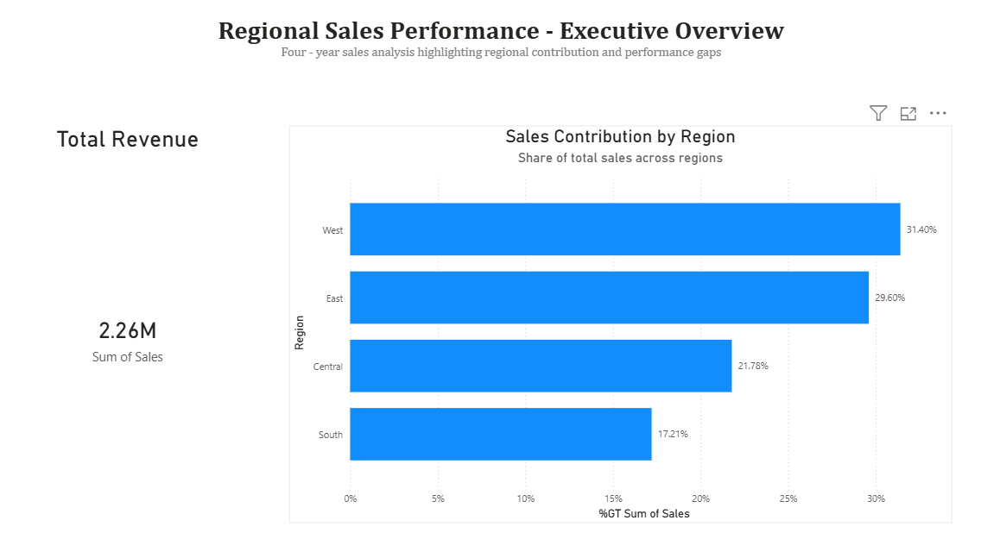
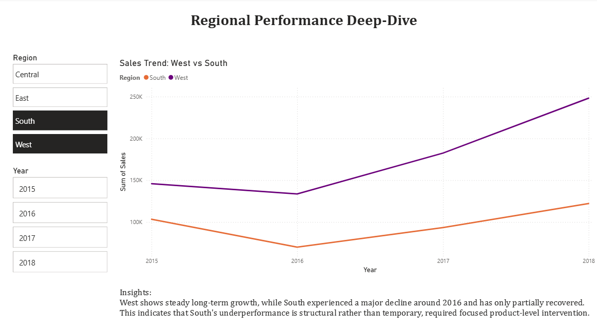
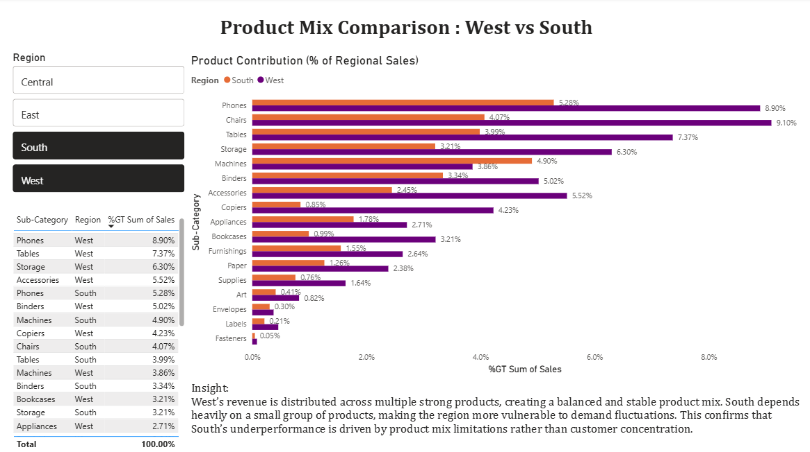

# Regional Sales Performance Analysis (Excel + Power BI)

## Overview
Analyzed 4 years of retail sales data across four regions (West, East, Central, South) to identify revenue concentration, product mix gaps, and performance drivers.

## Key Findings
- West is the top-performing region (~32% of total sales); South is the weakest (~17%).
- West shows steadier growth over time; South dropped sharply around 2016 and partially recovered.
- Product mix gaps (Phones, Chairs, Tables, Storage) explain much of the West vs South performance difference, indicating a product strategy issue rather than customer concentration.

## Tools
- Excel: data cleaning, pivot tables, charts, executive summary sheets
- Power BI: interactive dashboard with region/year filters

## Dashboard Screenshots
### Executive Overview

### Regional Performance Trend

### Product Mix Comparison

